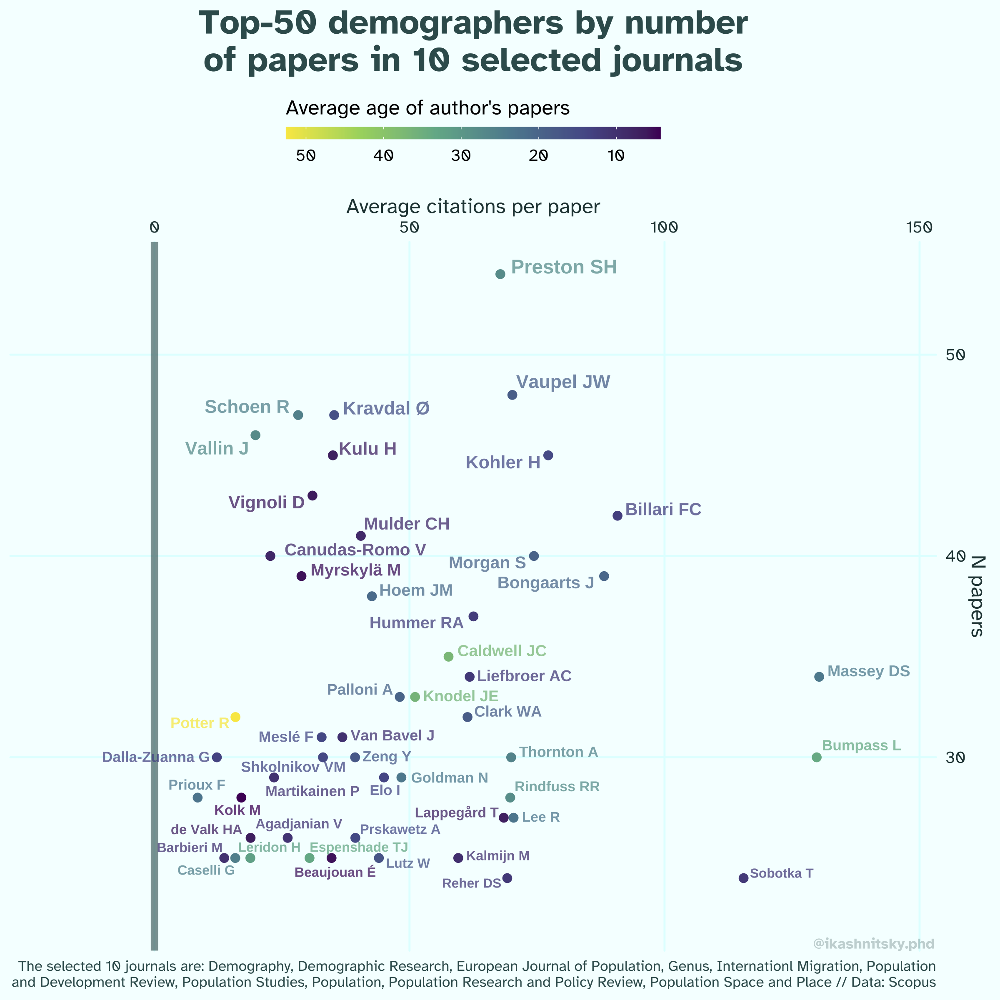

<!-- Top-50 authors in 10 leading demographic journals -->

I selected 10 leading demographic journals and using Scopus data looked which demographers published most papers in there ✨
I also calculated the average citations per paper for these authors and average age of their papers (in color) 👀
Isn't this demographic Hall Of Fame? 😅 

using author_id
selecting document types

UDP some critical reflections for this baby-step analysis:

Of course, there are multiple assumptions, imitations, and arbitrary decisions: 
— I chose only 10 journals as the demographic core (I can't think of a way to summon all demographic papers from all the not exclusively demographic journals; this selection is subjective and likely biased towards my view of demographic literature, obvious gap that I see is the field of family demography)
— the top-50 is cut by the number of publications in these journals (obvious fix — to remove editorials; but there may also be a way to include citations as a proxy of importance at the step of determining the top)
— the time horizon may receive special attention, not just color (would it make sense to introduce some measure of career stage?)
— Scopus had a specific bias for recency (openalex is the tool going forward)

Having this noted, the rest is objective. I think, in a way this *is* a demographic hall of fame 😅

***

[init]: https://fosstodon.org/@ikashnitsky/111626330689709952
[gist]: https://gist.github.com/ikashnitsky/819a7a87ed3844db0cce637f71e1c9f4
[bsky]: https://bsky.app/profile/ikashnitsky.phd/post/3kh5zbmftvw2f

