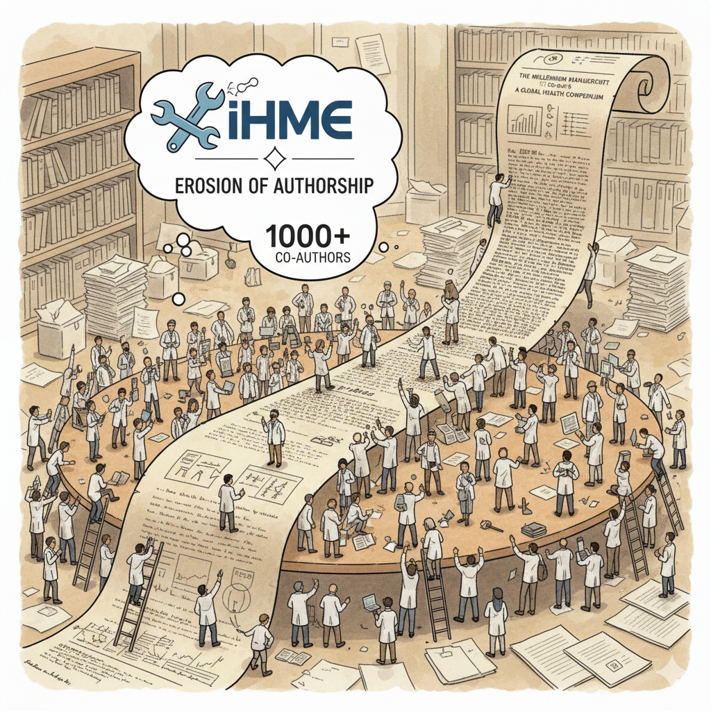

Recently, a [post on LinkedIn][li] highlighted a Google Scholar profile of an apparently just starting PhD researcher who suddenly started accumulating unbelievable counts of citations to his questionably numerous papers. Usually, such profiles are a clear indication of involvement into the worst publication practices, mostly paper mills. The post generated a predictable wave of comments along the lines of this common explanation. But this case is different, it is not the usual fraud per se. But this is a very curious and rather well known issue in public health / epidemiology / demography. 

There is a powerful group initially called the Global Burden of Diseases established by Chris Murray. Then, with outsized funding by Gates Foundation, this group morphed into an institute called IHME -- Institute of Health Metrics Evaluation. They are known for existing outside the normal science practice. As part of this, they are churning out papers in The Lancet as if it's their pocket preprint server. (The most beautiful party of the story is how IHME awarded the editor in chief of The Lancet with a [$100k award for his service to science][1] 🙃).  And these papers routinely washout the definition of authorship, as some of them list more than a thousand authors. Any collaborator, however insignificant, who may have provided a data point in their global reviews, becomes a highly cited researcher by the conventional metrics. 

IHME really screwed up the bibliometrics evaluation of several scientific fields. Thousands of researchers around the world claim unwarranted recognition for their blown-up citation metrics. And fractional counting (when incoming citations are shared by coauthors according to their contribution) is simply not yet there as the general-use go-to research evaluation tool. The net effect of this authorship-citation inflation is not innocent. I did a back-of-an-envelope [calculation back in 2021][2]. Since I didn’t find back my old calculations, I re-did it today. In the world of bibliometrics without fractional counting (think of the most widely circulated numbers from Google Scholar, Scopus, WoS), when you cite a paper with many authors, each one of them receives a full citation point. Basically, papers with more co-authors inflate the currency of this market via generating more citation points once they get cited. Now, back to the IHME issue. Consider [just one of the many GBD papers][3]. Yes, it lists 940 names as authors, and it’s cited 7550 times ([OpenAlex, 2025-10-09][4]). This  creates 7.1 million citation points. Just one paper, published in 2020. Now, my field’s leading journal Demography has published 3838 papers since its launch in 1964, and [these papers were cited 258k times][5]. Accounting for multiple authorship of these papers, we get 572k citation points. So, just one fairly recent IHME paper generated 12 times more citation points than all of the papers ever published in Demography journal in it's 6+ decades since 1964. [Data and replication code here][6].

The whole IHME story is a fascinating one (covered in all details by Timothy Schwab: [initial article in The Nation][7] and [a dedicated book later][8]) I guess, at the core of it is a genuine scientific endeavor. Chris Murray was a visionary in his early career, and the creation of the Global Burden of Diseases was an important milestone, impossible without his enthusiasm and organizational talent. It was his burning fire and the talent of igniting others that brought him to the massive and exclusive funding by Bill and Melinda Gates, who were apparently genuinely impressed and saw this outsized funding as an opportunity to contribute largely to the development of global public health. Which it did. At the beginning. But then a curious side effect happened (akin the digression of absolute monarchs) — the generous finding placed IHME outside the normal feedback and evaluation loop of the normal scientific process. And with time the quality of their products declined dramatically. Not necessarily the GBD most. But their global population estimates [were very problematic][9], and also obsolete with [World Population Prospects][10]. Even more outrageous fuckup happened with their COVID spread model, losing in prediction accuracy to *every* other model, notably to the one created by one postdoc. Fun fact, they eventually quietly retired the COVID model [as if the embarrassment never happened][11]. 

**Scientific excellence is impossible without feedback!**

[1]: https://www.healthdata.org/news-events/newsroom/news-releases/activist-editor-richard-horton-lancet-receives-100000-roux-prize
[2]: https://x.com/ikashnitsky/status/1440960984341000193
[3]: https://www.thelancet.com/journals/lancet/article/piis0140-6736(20)30752-2/fulltext
[4]: https://openalex.org/works/w3092861045
[5]: https://openalex.org/sources/s30543418
[6]: https://gist.github.com/ikashnitsky/cc6d7ee2d9d0e5af78822e6a467820ad
[7]:  https://www.thenation.com/article/society/gates-covid-data-ihme
[8]: https://www.amazon.com/Bill-Gates-Problem-Reckoning-Billionaire/dp/1250850096
[9]: https://www.thelancet.com/journals/lancet/article/PIIS0140-6736(21)01051-5/fulltext
[10]: https://doi.org/10.31235/osf.io/5syef
[11]: https://x.com/phytools_liam/status/1449443388256923653

::: {.callout-tip}
# This post is a rather spontaneous attempt to pull together my previous fragmented mentions of the issue over [Twitter][twi] and a more recent [LinkedIn comment][lic]
:::

***

[twi]: https://x.com/search?q=from%3Aikashnitsky%20ihme&src=recent_search_click
[li]: https://www.linkedin.com/posts/publishing-with-integrity_i-was-sent-a-google-scholar-profile-via-a-activity-7381133506355056640-TU2d
[lic]: https://www.linkedin.com/feed/update/urn:li:activity:7381133506355056640?commentUrn=urn%3Ali%3Acomment%3A%28activity%3A7381133506355056640%2C7381207133352087552%29&dashCommentUrn=urn%3Ali%3Afsd_comment%3A%287381207133352087552%2Curn%3Ali%3Aactivity%3A7381133506355056640%29
