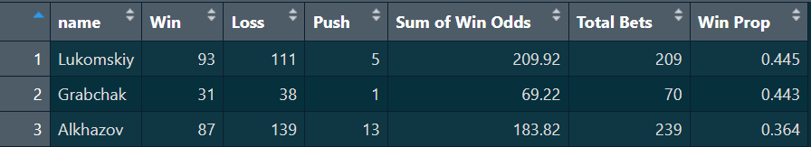

As football fans, we constantly hear pundits making bold predictions. But how often do they actually hit the targets? Let's check the track record of three popular Russian football pundits.  

[Vadim Lukomskiy](https://t.me/lukomski), [Denis Alkhazov](https://t.me/alhasbro), and [Vladimir Grabchak](https://t.me/barcafamilyyy) air a fantastic [La Liga Preview podcast on YouTube][yt]. Each week they discuss the upcoming matchday and offer their bets, one per game. Next week, they start by reviewing the outcomes. For a long while I was wondering how do the weekly predictions add up in the long run --I wanted to see whether a thorough knowledge of the specific league and a deep involvement can allow the pundits to stay in the profitable zone while betting on all the games of the season. 

So I decided to check it. In the current 2025-2026 season we have data up to matchday 28, and matchdays 6 and 18 were played midweek, so the guys happened to skip predictions. In total, 26 rounds, 10 games in each -- quite some data to play with. 

The data collection was a curious workflow in itself. I took screenshots of the predictions directly from the YouTube videos and used LLMs (Gemini and Claude) to parse the images and compile them into a clean dataset. Yet, there was a challenge along the way. LLMs struggled with team names that were represented with small logo images. Here's how a typical screenshot looked like:

![][screenshot] 

Sometimes they managed to pick up the names of the playing teams from the text description of the bet. But in other cases they had to leave placeholder marks "Team A" / "Team B". To fill the gaps, I cross-referenced it with a [dump of all played matches][fbref] in La Liga this season. This helped to figure out all the team names where the LLMs failed on the first run [^1]. 

[^1]: On the test run, Gemini gave me a perfect decoding of one screenshot. I thought that it used computer vision to read the team names from the logos, but it turned out that it just used the text transcript of the YouTube video that I linked in the initial prompt.

Anyways, with less effort than it would have taken to manually transcribe the predictions, I ended up with a tidy dataset of 259 predictions, including the predicted winner, the odds, and the actual match outcomes.

Naturally, I fired up R to answer two burning questions: was any of our three experts profitable in the long run, and whether they were systematically better at predicting the outcomes of some specific teams that they may know and understand the best?

## The Overall Scoreboard

First, let’s look at the overall performance. Evaluating a pundit isn't just about how many times they win; it's about the value of the odds they successfully predict. 

I was amused to see the results. Two of the three pundits managed to win 44% of their bets with the cumulative effect bringing them to almost  a perfectly neutral balance as a result. So, even an extremely deep domain knowledge and a high involvement in the league doesn't translate into a profitable betting strategy. No real surprise here, but just another reminder that one does not fool the system that is designed to fool him.

## Just bet on XXX -- you cannot miss

Well, maybe our experts know some of the teams so well that they can predict the outcomes of these teams much better? You know, football is highly contextual. A pundit might struggle to predict some team's volatile form but perfectly read another's tactical setups. I wanted to see if the pundits have "specialty" teams.

To do this, I reshaped the data so that every match counted for both the Home and Away teams involved, calculating the success rate for each pundit-team combination.

![][img]

Wow! Some fascinating patterns emerge:

- **Lukomskiy's Yellow Submarine:** Vadim has an incredible read on **Villarreal**. Out of 21 predictions involving them, he got 14 right—a massive 66.7% success rate over a large sample size. He also consistently reads Athletic Bilbao and Real Sociedad well.
- **Alkhazov's Levante:** Denis has certain success (luck?) with **Levante**, accurately predicting 14 out of 26 matches (53.8%). Interestingly, while he struggles overall compared to Vadim, his read on mid-to-lower table clashes seems to be his bread and butter. 
- **Grabchak's Flawless Osasuna:** Though his sample size is smaller, Vladimir went a perfect **7 for 7** on matches involving Osasuna. 
- All three pundits have consistently failed with the big trio **Real Madrid**, **Barcelona**, and **Atletico Madrid**, which is quite surprising given the perpetual attention to these clubs and their often consistent performance.

**Do pundits really know something specific about some teams, or is it just a matter of luck?** 

::: {.callout-tip}
# Code and data to reproduce this analysis are available on [GitHub][gh].
:::

***

[gh]: https://x.com/search?q=from%3Aikashnitsky%20ihme&src=recent_search_click
[img]: https://github.com/ikashnitsky/laliga-preview/raw/main/out/by-team.png
[yt]: https://youtube.com/playlist?list=PLZgJT1M3SJ9XVvZFlcJeCKUMzrMYCrCwc&si=RVs-ryd-bKHXuOBB
[screenshot]: https://github.com/ikashnitsky/laliga-preview/blob/main/dat/screenshots/Screenshot_20260319-163345.png?raw=true
[fbref]: https://fbref.com/en/comps/12/schedule/La-Liga-Scores-and-Fixtures

