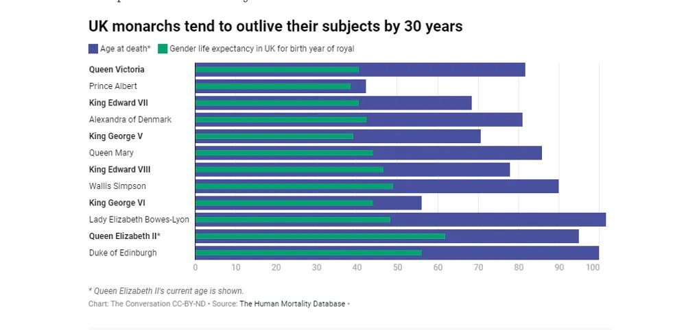
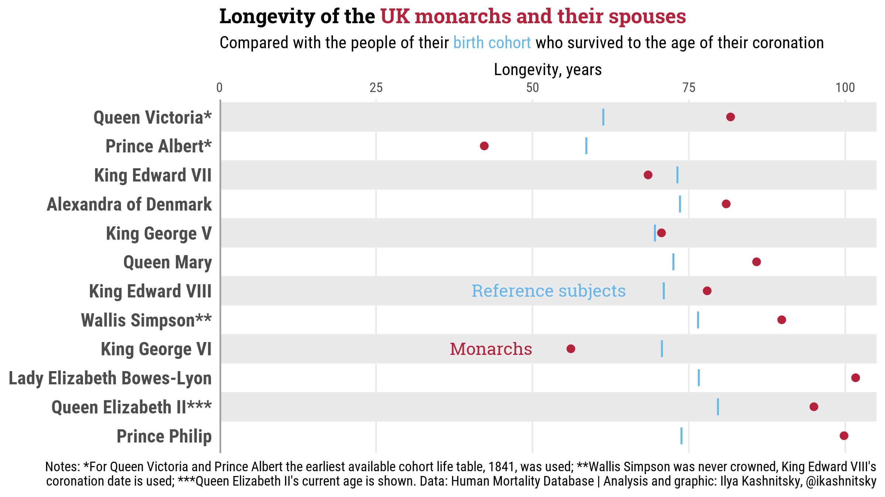
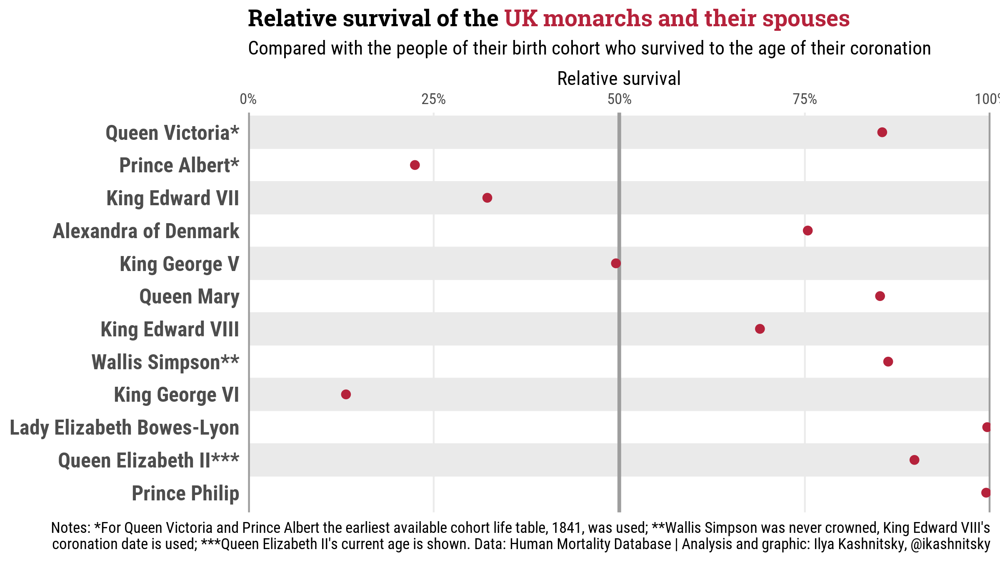
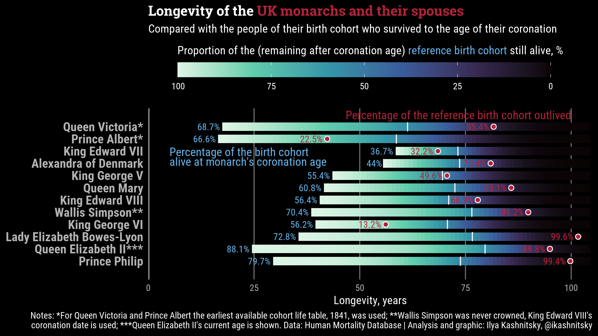

::: {.callout-note}
# End of March is the time when I remember with warm nostalgia the vivid memories of working alongside and learning from Jim Vaupel, who died untimely on 27th March 2022. He was a brilliant demographer and a vital person who radiated love to demography and influenced generations of researchers in finding and shaping their academic paths. Please read more about Jim on our collective memorial webpage -- <https://remembering-james-vaupel.org> 💚 In this post, I'm revisiting one of the last projects that we worked on with Jim. Unlike all other posts in my blog, here I'm using plural voice since an earlier draft of the analysis was co-authored with Jim.
:::

# Resonant headlines in the context of global news

Following the death of Prince Philip in April 2021, *The Conversation* published a [piece by Jay Olshansky][theconv] titled *"Long live the monarchy! British royals tend to survive a full three decades longer than their subjects."* In this, essentially, blog post routinely perceived by the media almost as a peer-reviewed article -- the usual problem with The Conversation -- the author compared the longevity of last six UK monarchs and their spouses with the longevity of their subjects. Employing a deeply flawed analysis, Olshansky arrived at sensational conclusions, which were, of course, elevated to the title of the piece and to the title of the only figure from the analysis, which [circulated widely in the media][media]. 

{width=80%}

Drawing far-reaching conclusions based on a handful of individuals' lifespans is already very problematic, since longevity of humans fluctuates a lot by chance. Yet, apart from this obvious statistical limitation, there are at least two purely demographic methodological flaws in the analysis that make the conclusions completely wrong. Olshansky compared the lifespan of a UK monarch or spouse with the **period life expectancy** that prevailed in the **year of their birth**. This is demographically wrong, for at least two reasons. 

# Flawed design of the analysis

**Firstly**, period life expectancy for a certain year is a poor predictor of the future lifespan of a child born in the year. [^1]  Despite the seemingly straightforward name, period life expectancy is **not** designed to forecast longevity, despite this being a way too often misinterpretation of the indicator. It is just a summary measure of current age-specific death rates in a population. In other words, life expectancy gives the average length of life for a cohort of newborns only in the unlikely (i.e. not registered in the observed human history) case when death rates remain unchanged throughout their lives. Mortality, however, has [decreased substantially][mort] over the past two centuries in all countries, including the UK, and the actual longevity of people born in a specific year is usually [much higher][gold] than the period life expectancy that was observed when they were born. 

[^1]: Have a look at my [previous post][prev-post] about common misinterpretations of life expectancy. 

Why is this error so important? Because life expectancy at birth in historical populations was massively skewed by staggering infant and child mortality rates. When we hear that medieval peasants had a life expectancy of 35, it wasn't because a hard life in the fields meant dropping dead at 36; it was because a huge fraction of the population died of disease during childhood. A peasant who reached adulthood actually had pretty good odds of reaching 60. And this leads us to the **second** massive flaw in the design of the initial analysis.

A monarch, by definition, has already survived childhood to reach the age of their coronation. It makes little sense to compare the actual fulfilled lifespans of royal individuals who succeeded to become monarchs with life expectancy **at birth** in the year of their birth. What about all their siblings who were less lucky? [^2] One simply cannot evaluate historical longevity without properly accounting for survival bias. It's all about selection and the luck of surviving through the hazardous early years of life. Back in the days, infant, child and early-adult mortality [used to be so high][inf] that it’s hard for us to imagine how society functioned when half of the lifeborn kids don’t reach teenage. For the purpose of this reanalysis, we need to factor in the -- too obvious when you spell it out -- truth: only those royalty who survived to the date of their coronation became monarchs. [^3] 

[^2]: In data analysis this common fallacy is known as [*survivorship bias*][xkcd].

[^3]: Interestingly, the age of UK monarchs' coronation varied widely, from 9 years for Queen Victoria to 59 years for King Edward VII.

# A demographically correct approach

So, what should a proper comparison look like if we still want to evaluate whether royals lived exceptionally long compared to their subjects? The methodological corrections are straightforward: 1) Instead of period life tables we should look at cohort life tables (also obtained from the [Human Mortality Database][hmd]); 2) As the comparison population, we need to look at the people who were born at the same year as the monarch in question and who survived at least until the age when this monarch was crowned. We compare monarch's lifespan against the  **remaining cohort life expectancy** of their birth cohort *at the exact age of the monarch's coronation*. Correcting for these two errors, we obtained the demographically correct results below. [^4]

[^4]: Let me re-iterate, just in case: we do not claim that this is a good way of researching the royal premium in survival. Our aim here is to correct the fundamental demographic flaws in the original widely circulated piece. 

The results? Yes, royals still enjoy a survival advantage over the general population. This is hardly a surprise -- living in extreme privilege gives you access to the best diet, living environments, and medical care of your era. But the sensational headline from Olshansky’s piece no longer holds. Instead of the claimed 30 year advantage, we see a more modest 7.7 years of extra survival, on average across the 12 monarchs and their spouses. 

And let's highlight again that even this largely corrected figure does not convincingly claim that the royals live much longer than their subjects. We are still comparing a summary of 12 individual lifespans against population-level demographic averages. Human lifespans vary. [^5]

[^5]: In a [recent article][phi] we introduced a new outsurvival measure to study differences in longevity between populations, taking into account lifespan inequality.

The longevity premium for royalty depends on the age of coronation -- the younger the monarch begins to reign, the fewer of those born in his or her year of birth are dead. Thus, the biggest differences in longevity are for those monarchs who stepped in very young, such as Queen Victoria or Queen Elizabeth II. When Queen Elizabeth II was crowned at age 25, 88% of her birth cohort was still alive. In comparison, when King Edward VII was crowned at age 59, only 37% of his birth cohort was alive. 

Another way to frame the comparison is to calculate the percentage of monarch’s birth cohort who were alive at the monarch’s coronation and who were subsequently outlived by this monarch. This is a sort of p-score for the monarch’s longevity -- how “well” did he or she “perform” compared correctly with their birth cohort.

King Edward VII outlived only 30% of males his age alive at his coronation: 70% of his peers alive at his crowning were alive at his funeral. Prince Philip outlived 99.5% of those UK males born in 1921 who lived at least until 1952. 

# Bonus

For the dedicated readers we offer a third plot in which we combined all the data discussed in the text in one figure. We realise it may be slightly challenging to process, but we also believe it provides a unique opportunity to see the whole data-story “at a glance”. 

{.preview-image}

*In the plot*: The colored stripes start at the age of the monarch's coronation, they fade out as the remaining birth cohort dies out; the average survival of the reference cohorts is marked with white vertical ticks; survival to the coronation is annotated in red labels.

***

::: {.callout-tip}
# Replication
You can find the data and the `R` code to reproduce this re-analysis in [this GitHub gist][gist]. The post is based on my earlier [Twitter thread][thread].
:::

[theconv]: https://theconversation.com/long-live-the-monarchy-british-royals-tend-to-survive-a-full-three-decades-longer-than-their-subjects-158766
[media]: https://www.altmetric.com/details/103817538
[gold]: https://doi.org/10.1080/00324720600895876
[mort]: https://doi.org/10.1073/pnas.2019536118
[prev-post]: https://ikashnitsky.github.io/2021/what-is-life-expectancy/
[inf]: https://ourworldindata.org/child-mortality-in-the-past
[xkcd]: https://xkcd.com/1827
[hmd]: https://www.mortality.org
[phi]: http://doi.org/10.4054/DemRes.2021.44.35
[gist]: https://gist.github.com/ikashnitsky/bec6af5ac0d57129a406ee5b5a522ce2
[thread]: https://x.com/ikashnitsky/status/1382595760756244481
